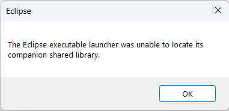
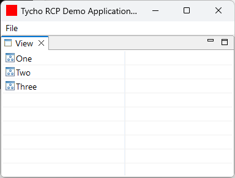
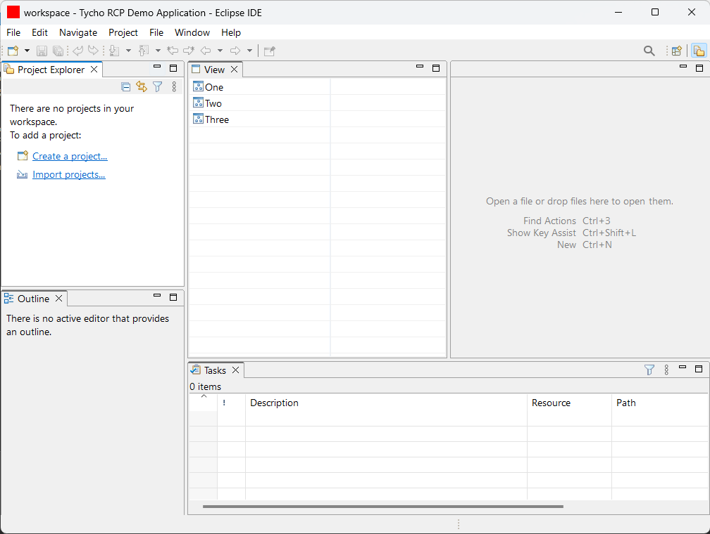

# QuickStart

- Clone project
- Run Maven command `mvn clean verify`

### Console log

```
[INFO] ------------------------------------------------------------------------
[INFO] Reactor Build Order:
[INFO]
[INFO] max.tycho-rcp-demo.parent                                          [pom]
[INFO] max.tycho-rcp-demo.rcp                                  [eclipse-plugin]
[INFO] max.tycho-rcp-demo.feature                             [eclipse-feature]
[INFO] max.tycho-rcp-demo.repository                       [eclipse-repository]
[INFO] max.tycho-rcp-demo.aggregator                                      [pom]


[INFO] ---------< max.tychorcpdemo.parent:max.tycho-rcp-demo.parent >----------
[INFO] Building max.tycho-rcp-demo.parent 1.0.0-SNAPSHOT                  [1/5]


[INFO] -----------< max.tychorcpdemo.parent:max.tycho-rcp-demo.rcp >-----------
[INFO] Building max.tycho-rcp-demo.rcp 1.0.0-SNAPSHOT                     [2/5]


[INFO] ---------< max.tychorcpdemo.parent:max.tycho-rcp-demo.feature >---------
[INFO] Building max.tycho-rcp-demo.feature 1.0.0-SNAPSHOT                 [3/5]


[INFO] -------< max.tychorcpdemo.parent:max.tycho-rcp-demo.repository >--------
[INFO] Building max.tycho-rcp-demo.repository 1.0.0-SNAPSHOT              [4/5]


[INFO] -------< max.tychorcpdemo.parent:max.tycho-rcp-demo.aggregator >--------
[INFO] Building max.tycho-rcp-demo.aggregator 1.0.0-SNAPSHOT              [5/5]


[INFO] ------------------------------------------------------------------------
[INFO] Reactor Summary for max.tycho-rcp-demo.parent 1.0.0-SNAPSHOT:
[INFO]
[INFO] max.tycho-rcp-demo.parent .......................... SUCCESS [  0.146 s]
[INFO] max.tycho-rcp-demo.rcp ............................. SUCCESS [  9.434 s]
[INFO] max.tycho-rcp-demo.feature ......................... SUCCESS [  0.269 s]
[INFO] max.tycho-rcp-demo.repository ...................... SUCCESS [  4.835 s]
[INFO] max.tycho-rcp-demo.aggregator ...................... SUCCESS [  0.004 s]
[INFO] ------------------------------------------------------------------------
[INFO] BUILD SUCCESS
[INFO] ------------------------------------------------------------------------
[INFO] Total time:  25.674 s
[INFO] Finished at: 2024-05-28T17:19:07+02:00
[INFO] ------------------------------------------------------------------------
```


## Results
### Application launched from prodct generated by command `mvn clean verify`


### Application launched from product generated by Eclipse export wizard


### Application launched from debug configuration
